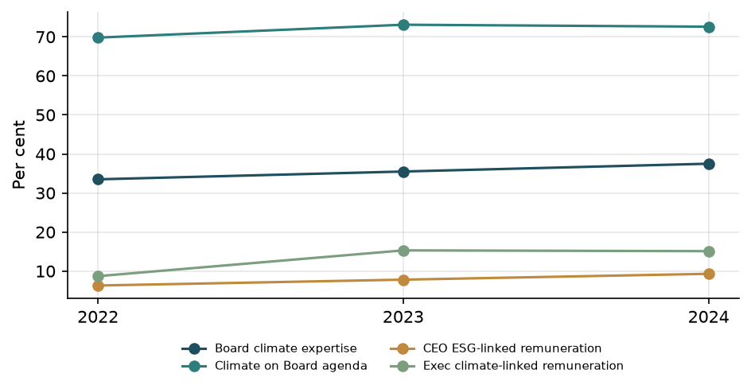
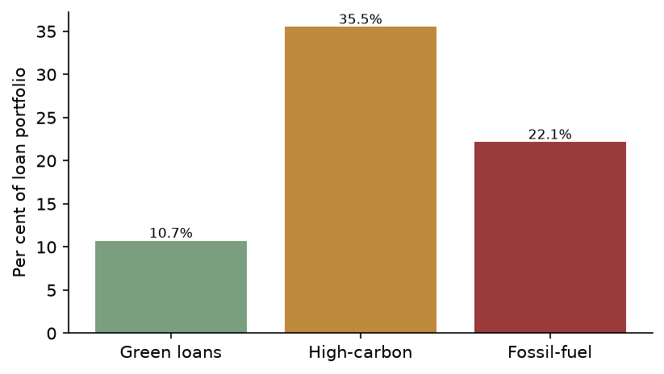

# Eurolux Universal Bank AG
## Sustainability-related Financial Disclosures (prepared with reference to IFRS S1 and IFRS S2)

**Reporting year:** 2024

---

## Table of contents

- [General Requirements](#general-requirements)
- [Governance](#governance)
- [Strategy](#strategy)
- [Risk Management](#risk-management)
- [Metrics and Targets](#metrics-and-targets)

---

### General Requirements

#### Understanding the Bank’s approach towards implementing IFRS S1 and IFRS S2 requirements

This report sets out Eurolux Universal Bank AG’s climate‑ and sustainability‑related financial disclosures. The disclosures are structured around the core areas reflected in IFRS S1 and IFRS S2: Governance, Strategy, Risk management, and Metrics and targets, with this General Requirements section providing the overarching basis of preparation.

The purpose of the report is to provide decision‑useful information on sustainability‑related and climate‑related risks and opportunities that could reasonably be expected to affect the Bank’s business model, cash flows, access to finance and cost of capital over the short, medium and long term. For the purposes of this report, the Bank currently uses the following indicative planning horizons:

- short term: up to 3 years;
- medium term: more than 3 years and up to 10 years; and
- long term: more than 10 years.

These horizons are intended to be broadly consistent with the Bank’s internal strategic and risk planning cycles. The Bank may refine these definitions as its sustainability‑related planning and reporting practices develop.

The report focuses in particular on:

- climate‑related transition and physical risks in the Bank’s own operations and financing activities;
- climate‑related opportunities where these are linked to the Bank’s products and services; and
- selected aspects of the governance, risk management and performance frameworks through which these risks and opportunities are identified, assessed, managed and monitored.

The Governance section describes key elements of Board and management oversight of climate and broader sustainability matters. The Strategy section outlines how climate‑related risks and opportunities are considered in the Bank’s strategic planning and portfolio positioning, including the use of climate scenario analysis where available. The Risk management section explains how climate‑related risks are integrated into the Bank’s risk management processes, including the use of a climate risk register. The Metrics and targets section sets out key indicators and targets, including financed‑emissions and portfolio‑exposure metrics, where these are available.

The Bank uses IFRS S1 and IFRS S2 as the primary framing for these disclosures and is progressively enhancing its approach. The report is intended to be aligned with the principles and core concepts of these standards; however, it does not constitute a statement of full legal compliance with IFRS Sustainability Disclosure Standards as adopted in any specific jurisdiction.

#### Fair presentation

The Bank aims to present climate‑ and sustainability‑related information in a transparent, balanced and decision‑useful manner. Disclosures are prepared using internal records, risk registers, value‑chain mapping, climate scenario analysis and portfolio‑exposure data, together with management’s judgement on the relevance and materiality of topics for Eurolux Universal Bank AG.

Parts of the report rely on estimates and models, particularly for climate scenario analysis and financed emissions. These estimates involve inherent uncertainty, including with respect to:

- the selection of climate scenarios and macroeconomic pathways;
- the availability and quality of counterparty‑level emissions and activity data;
- the allocation of financed emissions to specific portfolios and sectors; and
- the translation of climate‑related risk drivers into potential financial impacts.

In addition, some information in this report is derived from analytical tools and approximations where direct measurement is not yet feasible. Where data is incomplete or methodologies are still evolving, the Bank uses assumptions and proxies that it considers appropriate for the current stage of development. In such cases, the Bank seeks to describe the nature of the metrics and key limitations at a high level in the relevant sections of the report. The Bank does not claim that the information is exhaustive or that all climate‑ and sustainability‑related risks and opportunities have been fully quantified or captured.

The Bank’s governance‑related disclosures draw on Board and management records, including information on committee structures, meeting frequency, skills and remuneration linkages, but do not purport to provide a comprehensive description of all governance arrangements. Detailed operational greenhouse gas emissions data are not presented in this report, and detailed calculation methodologies, data‑quality assessments and key assumptions for operational greenhouse gas metrics and certain other indicators are not disclosed. The Bank continues to strengthen its data, systems and controls for climate‑ and sustainability‑related reporting and expects the precision and coverage of disclosures to improve over time.

The report is not externally assured as a whole. Any external assurance, where obtained, is limited to selected greenhouse gas information relating to Scope 1 and Scope 2 emissions. Financed‑emissions metrics and other portfolio‑related climate indicators disclosed in this report are not externally assured.

#### Connected information

The report is designed to enable users to understand the connections between the Bank’s governance, strategy, risk management, and metrics and targets in relation to climate‑ and sustainability‑related matters.

- Governance: The Governance section describes Board‑level oversight of climate‑related risks and opportunities, the role of Board committees, and management responsibilities for implementing climate‑related strategies and risk management processes. It includes selected governance trend metrics such as the frequency of ESG‑related committee meetings, the proportion of Board members with climate expertise, the extent of climate‑linked remuneration, the share of Board meetings with climate on the agenda, and overall Board meeting frequency.

- Strategy: The Strategy section explains how climate‑related risks and opportunities are considered in the Bank’s strategic planning, including the use of a climate risk register and climate scenario analysis. It outlines key exposures in the lending portfolio, including sectors with elevated transition risk (such as mining of coal and lignite, manufacture of coke and refined petroleum, other mining and quarrying, mining of metal ores and air transport) and sectors with notable physical‑risk exposure (such as manufacture of motor vehicles, manufacture of electrical equipment, manufacture of food products, civil engineering and education). It also describes, at a high level, how these exposures may influence the Bank’s strategic choices and portfolio steering over different time horizons.

- Risk management: The Risk management section sets out how climate‑related risks are identified, assessed, monitored and managed within the Bank’s broader risk management framework. This includes the integration of climate‑related risk drivers into the climate risk register, the mapping of risks to value‑chain nodes (own operations, upstream suppliers and financing counterparties), and the use of scenario analysis outputs, where available, to inform risk assessments and potential risk‑mitigation actions.

- Metrics and targets: The Metrics and targets section provides quantitative indicators and targets that support the Strategy and Risk management sections. These include financed‑emissions metrics, portfolio‑exposure metrics to higher‑risk sectors, and climate‑related targets where defined. These metrics are linked to the Bank’s governance arrangements through climate‑related performance indicators and remuneration linkages, and to the risk management framework through risk appetite and monitoring processes.

Connections between these areas are reflected throughout the report. For example, the climate risk register and scenario analysis inform both the Strategy and Risk management sections and underpin the selection of key metrics and targets. Governance structures oversee the development and implementation of climate‑related strategies, the integration of climate risk into risk management, and the monitoring of progress against climate‑related metrics and targets. Users are encouraged to read the sections together to understand how climate‑related risks and opportunities may affect the Bank’s prospects over the short, medium and long term.

#### Comparative information

Where trend information is available, the Bank provides comparative information to support users in assessing progress over time. For governance, trend metrics are available for:

- the number of ESG‑related committee meetings;
- the percentage of Board members with climate‑related expertise;
- the percentage of the CEO’s remuneration linked to ESG or climate‑related performance;
- the percentage of executive management with climate‑linked remuneration components;
- the percentage of Board meetings at which climate‑related topics were on the agenda; and
- the frequency of full Board meetings.

These governance trend metrics are presented in the Governance and Metrics and targets sections, enabling users to assess how Board and management oversight of climate‑related matters is evolving.

For portfolio‑exposure metrics, financed‑emissions metrics and other climate‑related quantitative indicators, consistent prior‑year comparative figures are not yet available. The Bank is in the process of building the data, methodologies and systems required to generate robust time‑series information for these metrics. As a result, certain metrics are presented for a single reporting period only. Where methodologies or definitions change in future periods, the Bank will explain material changes and, where practicable, provide context to support comparability over time.

#### Timing and location of disclosure

This report presents sustainability‑related and climate‑related financial disclosures for Eurolux Universal Bank AG. The report is prepared as a dedicated sustainability and climate report for the Bank.

The specific reporting year and the start and end dates of the reporting period are not specified in this report. Accordingly, this report does not state whether the reporting period is the same as that of the Bank’s related general‑purpose financial statements, nor does it assert that the disclosures are published at the same time as those financial statements.

The report is intended to provide users with information on sustainability‑related and climate‑related risks and opportunities in a format that can be considered alongside the Bank’s financial reporting. However, no particular external filing location or publication channel is specified in this report. The Bank may in future consider further integration of sustainability‑related disclosures with other reporting channels as regulatory and market practices evolve.

#### Reporting entity, business model and value chain

The reporting entity for this report is Eurolux Universal Bank AG, headquartered in Germany. The presentation currency used for all monetary amounts in this report is the euro (EUR), consistent with the Bank’s financial reporting currency.

Eurolux Universal Bank AG reports total assets of approximately EUR 850,000 million and total loans of approximately EUR 31,150.64 million. These figures provide an indication of the scale of the Bank’s balance sheet and lending activities, which are central to the assessment of climate‑related risks and opportunities, particularly in relation to financed emissions and sectoral portfolio exposures.

Information on the consolidation boundary, the inclusion of subsidiaries and the alignment of the sustainability reporting boundary with the financial statement boundary is not specified in this report. Accordingly, the disclosures should be interpreted as relating to Eurolux Universal Bank AG as the reporting entity, without a detailed description of group‑wide consolidation scope for sustainability‑related information.

The Bank’s business model is that of a universal commercial bank. While detailed business‑line descriptions are not provided in this section, the value‑chain mapping used for climate‑related risk assessment distinguishes between:

- Own operations: including banking buildings and facilities, and the corporate fleet and business travel. These activities are associated with Scope 1 and Scope 2 emissions and are exposed to potential physical disruption and transition‑related changes in operating practices and costs.

- Upstream suppliers: including IT infrastructure and cloud providers, office space landlords and professional services suppliers. The Bank’s exposure to IT and cloud providers is approximately EUR 223.85 million, to office space landlords approximately EUR 445.41 million, and to professional services suppliers approximately EUR 120.73 million. These relationships are relevant for understanding upstream environmental and climate‑related dependencies, although they are not currently assessed as material climate‑related risk drivers for the Bank.

- Downstream activities and financing counterparties: including corporate borrowers across a range of sectors. Particular attention is given to sectors with elevated transition risk, such as mining of coal and lignite, manufacture of coke and refined petroleum, other mining and quarrying, mining of metal ores and air transport, where lending is exposed to potential impacts from carbon pricing, regulatory change and demand shifts. Sectors with notable physical‑risk exposure, such as manufacture of motor vehicles, manufacture of electrical equipment, manufacture of food products, civil engineering and education, are also identified, reflecting potential chronic physical risk to underlying assets and operations.

This value‑chain perspective supports the identification of climate‑related risk concentrations and informs the Bank’s approach to financed‑emissions metrics, portfolio steering and engagement with clients in higher‑risk sectors.

#### Sources of guidance

The Bank uses IFRS S1 and IFRS S2 as the primary framework for structuring and describing its sustainability‑related and climate‑related financial disclosures. The concepts of sustainability‑related risks and opportunities, the focus on information that could reasonably be expected to affect the Bank’s prospects, and the organisation of disclosures around governance, strategy, risk management, and metrics and targets are drawn from these standards.

The Bank seeks, over time, to align the data and assumptions used in preparing its sustainability‑related disclosures with those used in preparing its related financial statements, including the use of the same presentation currency. Full alignment of assumptions, including those used in climate scenario analysis, with the assumptions applied in financial reporting has not yet been achieved and remains an area of ongoing development.

In this reporting cycle, the Bank has not systematically applied or mapped its disclosures to the disclosure topics and metrics of the SASB Standards or to other industry‑specific sustainability reporting frameworks. No additional external sustainability reporting standards or pronouncements beyond IFRS S1 and IFRS S2 have been applied as a formal basis for preparing this report. The Bank will consider the relevance of other frameworks, including SASB disclosure topics and metrics for banking activities, in future reporting cycles as it further develops its sustainability‑related reporting.

The Bank operates within a European sustainability reporting environment and monitors developments in sustainability reporting requirements that may apply to banks operating in Europe. As these requirements evolve, the Bank expects to further refine its reporting approach and may incorporate additional guidance or jurisdiction‑specific requirements in future reporting cycles.

#### Statement of compliance

This report is prepared using IFRS S1 and IFRS S2 as the principal reference framework for sustainability‑related and climate‑related financial disclosures. The Bank seeks to align its disclosures with the objectives and core concepts of these standards, including:

- focusing on sustainability‑related risks and opportunities that could reasonably be expected to affect the Bank’s prospects;
- providing information that is intended to be comparable, verifiable, timely and understandable; and
- explaining the connections between governance, strategy, risk management, and metrics and targets.

At this stage, the Bank does not assert full compliance with IFRS Sustainability Disclosure Standards as formally adopted in any jurisdiction. Certain elements of the standards, such as comprehensive historical comparatives for all metrics, detailed methodological disclosures for all indicators, and full integration of sustainability‑related and financial reporting boundaries, are still being developed.

The Bank views this report as an important step in its journey towards more comprehensive and standard‑aligned sustainability‑related financial reporting. The Bank intends to continue enhancing the scope, quality and integration of its climate‑ and sustainability‑related disclosures over time, taking into account evolving regulatory expectations, market practices and internal capabilities.

#### Materiality assessment

The selection of topics and disclosures in this report is driven by a risk‑ and portfolio‑based assessment of sustainability‑related and climate‑related matters that could reasonably be expected to affect Eurolux Universal Bank AG’s prospects. The Bank has not yet developed or documented a standalone IFRS S1 materiality process; instead, the report draws on existing risk and portfolio analysis processes.

The Bank’s approach to identifying material climate‑ and sustainability‑related topics for this report is based on:

- Risk registers: The climate risk register and related risk management processes identify key climate‑related risk drivers, including transition and physical risks, and link them to specific risk types and business activities. These risk registers inform the Strategy and Risk management sections and guide the selection of disclosures on risk exposures and management responses.

- Portfolio‑exposure mapping: The Bank maps its lending portfolio to economic sectors and identifies sectors with elevated transition or physical risk. This includes, for example, exposures to mining of coal and lignite, manufacture of coke and refined petroleum, other mining and quarrying, mining of metal ores, air transport, manufacture of motor vehicles, manufacture of electrical equipment, manufacture of food products, civil engineering and education. The size and risk profile of these exposures inform the focus of the Strategy and Metrics and targets sections.

- Value‑chain mapping: The Bank’s value‑chain map distinguishes between own operations, upstream suppliers and downstream financing counterparties. Activities assessed as having material climate‑related risk (such as own banking operations, corporate fleet and business travel, and selected high‑risk corporate borrower sectors) are prioritised for disclosure, while activities assessed as non‑material for climate‑related risk are described at a higher level or not quantified.

- Scenario analysis and metrics: Climate scenario analysis and financed‑emissions metrics, where available, are used to identify areas where climate‑related risks and opportunities may have a more pronounced effect on the Bank’s business model, portfolio and risk profile over different time horizons. These analytical tools support the prioritisation of disclosures on high‑risk sectors, financed emissions and climate‑related targets.

The Bank applies judgement in determining which information is material for inclusion in this report, focusing on matters that could reasonably be expected to influence users’ assessments of the Bank’s prospects. Not all sustainability‑related topics are covered, and some topics may be described qualitatively where quantitative data is not yet available or sufficiently robust. The Bank does not currently disclose a comprehensive list of all sustainability‑related risks and opportunities considered immaterial for reporting purposes.

The Bank recognises that expectations regarding materiality assessments for sustainability‑related reporting are evolving, particularly in the European sustainability reporting environment. Over time, the Bank intends to further formalise and document its sustainability‑related materiality assessment processes, enhance the integration of climate‑related considerations into enterprise‑wide risk and strategy processes, and expand the range and depth of disclosures where this is decision‑useful for users of its general‑purpose financial reports.

---

### Governance

#### Overview

Eurolux Universal Bank AG integrates climate-related governance into its overall corporate governance framework. Climate-related governance is reflected in Board oversight, ESG & Sustainability Committee activity, executive management responsibility, semi-annual Board reporting, integration of climate-related risks into the enterprise risk management framework, climate checks for major transactions and the use of a climate risk register.

The Board of Directors oversees climate-related risks and opportunities through its regular meeting cycle, climate-related agenda coverage and documented 2024 Board and committee decisions. The ESG & Sustainability Committee provides more detailed consideration of climate-related topics and prepares climate-related matters for Board consideration. At management level, the Climate Risk Management Committee oversees the use of the climate risk register and provides climate risk reporting to the Board.

Climate-related skills and competencies are reflected in the proportion of Board members with climate expertise and in a skills development programme. Remuneration for the Chief Executive Officer and other executives includes ESG- and climate-linked components. Controls and procedures include the use of a climate risk register that, in 2024, recorded eight climate-related risks, flags indicating integration of those risks into the enterprise risk management framework, climate checks for major transactions and limited external assurance over Scope 1 and Scope 2 greenhouse gas emissions.

#### The role of the Board of Directors

The Board of Directors of Eurolux Universal Bank AG comprises 10 members, of whom 68.5% are independent. In the year ended 31 December 2024, the Board met eight times, compared with seven meetings in 2023 and four meetings in 2022. Climate-related topics were included on the Board agenda in 72.6% of meetings in 2024, compared with 73.1% in 2023 and 69.8% in 2022. This trend indicates that climate-related matters have been a recurring topic in Board deliberations over the past three years.

Climate risk reporting is provided to the Board on a semi-annual basis. This reporting provides an overview of material climate-related risks drawn from the climate risk register. Through this reporting and its broader agenda, the Board is informed about climate-related risks and opportunities and their potential implications for the Bank.

The Board oversees the setting and monitoring of climate-related targets through its consideration of management reports and its documented climate-related decisions in 2024, which are set out in the Governance decisions, controls and evidence boundaries subsection. These decisions, together with the semi-annual climate risk reporting and the inclusion of climate-related topics on the Board agenda, show how the Board takes climate-related risks and opportunities into account when overseeing the Bank’s strategy, major decisions and risk management.

The Bank does not currently disclose a separate climate-specific Board charter or terms of reference. Governance activity is described on the basis of Board composition, meeting frequency, climate-related agenda coverage, semi-annual reporting and documented climate-related decisions.

#### Board committees and climate-related oversight

The Board is supported by an ESG & Sustainability Committee, which considers climate-related matters in more detail and reports to the Board. The ESG & Sustainability Committee met seven times in 2024, compared with six meetings in 2023 and five meetings in 2022, indicating an increasing frequency of committee engagement on ESG and climate-related topics over the period.

The ESG & Sustainability Committee prepares climate-related matters for Board consideration and is involved in reviewing climate-related targets, methodologies and plans before they are submitted to the Board. In 2024, the committee considered climate-related topics that resulted in documented climate-related decisions by the committee and the Board. These decisions are described in the Governance decisions, controls and evidence boundaries subsection.

The Bank does not currently disclose the ESG & Sustainability Committee’s charter or formal terms of reference. The scope of the committee’s climate-related oversight is therefore described on the basis of its meeting frequency, its reporting line to the Board and the documented climate-related decisions in which it has been involved.

#### Management responsibility for climate-related risks and opportunities

Management responsibility for climate-related risks and opportunities is assigned to the Climate Risk Management Committee. This committee oversees the use of the climate risk register and provides climate risk reporting to the Board on a semi-annual basis.

The Bank uses a climate risk register that, in 2024, recorded eight climate-related risks. These risks cover both physical and transition risk categories, including acute and chronic physical risks and market, policy, reputational and technology-related transition risks. The register records risk ratings (high or medium), time horizons (short term of up to two years, medium term of two to five years and long term of more than five years) and monitoring frequencies (quarterly or semi-annual). In 2024, four of the eight climate-related risks changed compared with the prior period.

The climate risk register includes identifiers that link selected risks to specific climate scenarios. In 2024, several of the recorded risks were linked to such scenarios, while others were not. The register also records mitigation actions at the risk level. The climate risk register records the following mitigation actions:

- climate scenario stress testing integrated into the Internal Capital Adequacy Assessment Process;
- collateral revaluation and the use of flood mapping overlays;
- engagement and transition-plan covenants with borrowers;
- green retrofit financing incentives;
- portfolio decarbonisation glide-path monitoring; and
- sector exposure limits and enhanced due diligence.

The climate risk register records flags indicating whether individual risks are integrated into the enterprise risk management framework. In 2024, six of the eight climate-related risks were flagged as integrated into the Bank’s enterprise risk management framework. In addition, climate-related risk management is flagged as integrated into the enterprise risk management framework at Bank level. The Bank does not claim full integration of all climate-related risks beyond these flags.

The climate risk register includes specific examples of material climate-related risks, such as:

- a high-rated transition technology risk related to the shift to electric vehicles in auto lending, with a short-term time horizon, quarterly monitoring, an estimated potential financial impact of approximately EUR 165 million and a link to a climate scenario. For this risk, the climate risk register records climate scenario stress testing integrated into the Internal Capital Adequacy Assessment Process as the mitigation action;
- a high-rated transition market risk related to potential stranded assets in fossil fuel sector exposures, with a long-term time horizon, quarterly monitoring and an estimated potential financial impact of approximately EUR 137 million. For this risk, the climate risk register records collateral revaluation and the use of flood mapping overlays as the mitigation action;
- a high-rated transition policy risk related to carbon pricing on industrial loans, with a medium-term time horizon, quarterly monitoring and an estimated potential financial impact of approximately EUR 68 million. For this risk, the climate risk register records sector exposure limits and enhanced due diligence as the mitigation action;
- a high-rated acute physical risk related to mortgage book flood exposure, with a long-term time horizon, quarterly monitoring, an estimated potential financial impact of approximately EUR 25 million and a link to a climate scenario. For this risk, the climate risk register records engagement and transition-plan covenants with borrowers as the mitigation action; and
- a medium-rated transition reputational risk related to scrutiny of financed emissions, with a medium-term time horizon, semi-annual monitoring, an estimated potential financial impact of approximately EUR 66 million and a link to a climate scenario. For this risk, the climate risk register records portfolio decarbonisation glide-path monitoring as the mitigation action.

Climate checks for major transactions are recorded as part of management processes. This indicates that climate-related considerations are taken into account in the assessment of major transactions, although the Bank does not currently disclose a formal mandatory policy governing such checks.

The Bank does not currently disclose formal escalation thresholds or trigger-based escalation mechanics for climate-related risks. Management oversight is therefore described in terms of the climate risk register, flags indicating integration into the enterprise risk management framework, monitoring frequencies, mitigation actions, climate checks for major transactions and semi-annual reporting to the Board.

#### Skills, competencies and remuneration

Board-level climate-related skills and competencies are reflected in the proportion of Board members with climate expertise. In 2024, 37.5% of Board members were recorded as having climate-related expertise, compared with 35.5% in 2023 and 33.5% in 2022. This upward trend indicates an increase in climate-related expertise on the Board over the three-year period.

The Bank operates a skills development programme that includes climate-related content for Board members and senior management. This programme is intended to support ongoing development of climate-related knowledge and competencies relevant to the Bank’s strategy and risk profile. The Bank does not currently disclose a formal process for assessing the adequacy of Board climate-related skills and competencies; instead, the disclosure is based on the recorded proportion of Board members with climate expertise and the existence of the skills development programme.

Remuneration for the Chief Executive Officer includes an ESG-linked component. In 2024, 9.3% of the CEO’s compensation was linked to ESG-related measures, compared with 7.8% in 2023 and 6.3% in 2022. For the broader executive population, 15.1% of remuneration was linked to climate-related measures in 2024, compared with 15.3% in 2023 and 8.7% in 2022. These metrics indicate that climate- and ESG-related performance measures are incorporated into executive remuneration and that the weighting of such measures has increased over the three-year period, particularly for the CEO.

The inclusion of ESG- and climate-linked components in executive remuneration provides a mechanism through which the Board can align management incentives with the Bank’s climate-related objectives and targets. The specific performance metrics and targets associated with these remuneration components are described in the metrics and targets section of this report.

#### Governance decisions, controls and evidence boundaries

In 2024, the Board and its ESG & Sustainability Committee took a number of specific climate-related decisions:

- On 24 January 2024, the Board approved the 2024 ESG report for publication. In the same decision process, the Board considered matters related to carbon credit approval and review of the transition plan.
- On 15 April 2024, the ESG & Sustainability Committee approved the climate scenario analysis methodology. This decision was subsequently considered by the Board in meetings on 10 June, 17 July and 29 August 2024, in the context of topics including executive remuneration ESG key performance indicators, progress against net-zero objectives, updates on physical climate risks, review of climate-related financial disclosure frameworks and review of the transition plan.
- On 15 April, 20 May and 19 July 2024, the ESG & Sustainability Committee considered climate-related topics including executive remuneration ESG key performance indicators, progress against net-zero objectives, updates on physical climate risks, climate scenario analysis, review of climate-related financial disclosure frameworks and review of the transition plan, leading to a Board decision on 26 November 2024 to approve the carbon credit procurement budget for 2024.
- On 7 October 2024, the Board endorsed an updated transition plan, following prior consideration of climate-related financial disclosure topics and green finance growth.
- On 1 November 2024, the Board endorsed a revision of interim net-zero targets, following consideration of progress against those targets.

These decisions illustrate how the Board and the ESG & Sustainability Committee take climate-related risks and opportunities into account when overseeing the Bank’s strategy, major decisions and risk management processes, including the oversight of climate-related targets and the inclusion of climate-related performance metrics in executive remuneration.

Controls and procedures relevant to climate-related governance in 2024 included:

- the use of a climate risk register that recorded eight climate-related risks, with risk categories, ratings, time horizons, monitoring frequencies, links to climate scenarios for selected risks, mitigation actions and flags indicating integration into the enterprise risk management framework for six of the eight risks;
- semi-annual climate risk reporting to the Board, providing an overview of material climate-related risks drawn from the climate risk register;
- climate checks for major transactions, indicating that climate-related considerations are taken into account in the assessment of such transactions;
- climate-related risk management flagged as integrated into the enterprise risk management framework at Bank level;
- the integration of climate scenario stress testing into the Internal Capital Adequacy Assessment Process as a mitigation action recorded in the climate risk register; and
- the inclusion of ESG- and climate-linked components in CEO and executive remuneration, with three-year trend data for the relevant percentages.

External assurance over climate-related information in this report is limited to Scope 1 and Scope 2 greenhouse gas emissions. In 2024, Eurolux Universal Bank AG obtained limited assurance from EY in accordance with ISAE 3000 over its Scope 1 and Scope 2 emissions. Financed emissions and other Scope 3 categories, including the Bank’s 2024 financed emissions of approximately 36 million tonnes of carbon dioxide equivalent, are outside the scope of this external assurance.

Internal governance data classify the Bank’s climate-related disclosures as aligned with the recommendations of the Task Force on Climate-related Financial Disclosures and with IFRS S2. These alignment indicators reflect internal classification of the disclosures. The Bank does not currently operate a separate governance control process specifically designed to verify or assure alignment with these frameworks beyond the governance mechanisms described in this section and the external assurance over Scope 1 and Scope 2 emissions.

The Bank does not currently disclose:

- a climate-specific Board or committee charter, terms of reference or formal mandate. Governance roles are therefore described on the basis of Board and committee composition, meeting frequency, agenda coverage, reporting cadence and documented decisions;
- quantified or specific Board-level trade-offs between climate-related objectives and other considerations such as profitability, capital allocation, implementation cost, risk appetite or competing strategic priorities. The 2024 decision records identify climate-related decisions but do not describe such trade-offs;
- a formal process for assessing the adequacy of Board climate-related skills and competencies. Skills-related disclosures are based on the proportion of Board members with climate expertise and the existence of a skills development programme;
- formal escalation thresholds or trigger-based escalation mechanics for climate-related risks. The description of management controls is therefore limited to the climate risk register, flags indicating integration into the enterprise risk management framework, monitoring frequencies, mitigation actions, climate checks for major transactions and semi-annual reporting to the Board; or
- a formal policy document governing climate checks for major transactions. The Bank records that climate checks are applied to major transactions but does not currently disclose a detailed policy framework for these checks.

Management committee names recorded over the three-year period (Group Sustainability Committee in 2022, ESG Executive Committee in 2023 and Climate Risk Management Committee in 2024) differ by year. The Bank does not currently disclose whether these committees represent a single evolving committee or separate bodies.

These boundaries reflect the current scope and maturity of Eurolux Universal Bank AG’s climate-related governance disclosures for the year ended 31 December 2024.

#### Supporting data and exhibits

**Table G1 — Climate governance indicators (three-year trend)**
{: .exhibit-caption }

| Indicator | 2022 | 2023 | 2024 |
|---| ---: | ---: | ---: |
| Full Board meetings | 4 | 7 | 8 |
| ESG & Sustainability Committee meetings | 5 | 6 | 7 |
| Board members with climate expertise | 33.5% | 35.5% | 37.5% |
| Meetings with climate on the agenda | 69.8% | 73.1% | 72.6% |
| CEO remuneration linked to ESG | 6.3% | 7.8% | 9.3% |
| Executive remuneration linked to climate | 8.7% | 15.3% | 15.1% |

**Figure G1 — Climate governance indicators, 2022–2024**
{: .exhibit-caption }

---

### Strategy

#### Overview

Eurolux Universal Bank AG integrates climate-related considerations into its business strategy through a structured architecture that links risk identification, portfolio steering, product development, resource allocation and scenario analysis. The strategy focuses on understanding physical and transition risks across the value chain, embedding these risks into credit and capital frameworks, and developing transition-related financing opportunities, while monitoring progress against climate-related targets.

The lending book is the primary transmission channel for climate-related risks and opportunities, complemented by actions in own operations and procurement. Climate factors are incorporated into sector risk assessments, credit analysis and scenario-based stress testing, and inform the Bank’s transition and net-zero ambitions, which are further described in the Metrics and targets section. Dedicated climate-related capital and operating expenditure support implementation. Scenario analysis based on NGFS version 4 pathways provides a forward-looking view of potential financial impacts and informs strategic planning over the short term (0–2 years), medium term (2–5 years) and long term (beyond 5 years).

#### Sustainability risks and opportunities across the value chain

The Bank’s climate-related risk profile is shaped by both physical and transition drivers across its value chain. The 2024 climate risk register identifies eight material climate-related risks, including three physical and five transition risks, with time horizons classified as short term (0–2 years), medium term (2–5 years) and long term (beyond 5 years).

Physical risks arise primarily in the downstream lending portfolio and own operations. Key examples include flood exposure in the mortgage book and wildfire exposure in southern portfolios, both rated as high or medium risk with potential financial impacts of 24.8 million euro and 22.7 million euro respectively. Own banking buildings and the corporate fleet are also exposed to chronic physical risks and potential operational disruption.

Transition risks are concentrated in high-carbon sectors and fossil-fuel-related activities. High-carbon sector exposure represents 35.5% of the loan book, or 11,059.49 million euro, and fossil fuel exposure accounts for 22.15%, or 6,899.59 million euro. Material transition risks include stranded assets in fossil fuel sectors (estimated impact 136.5 million euro), technology-driven shifts such as electric vehicles in auto lending (165.2 million euro), carbon pricing on industrial loans (67.5 million euro), and reputational risk from scrutiny of financed emissions (65.5 million euro). Financed emissions associated with the lending portfolio are estimated at 35.97 million tonnes of carbon dioxide equivalent, corresponding to a carbon intensity of 1,154.81 tonnes of carbon dioxide equivalent per million euro of exposure.

Across the value chain, the most material nodes are downstream financing counterparties in carbon-intensive sectors. These include corporate borrowers in the manufacture of coke and refined petroleum (3,903.65 million euro), mining of coal and lignite (3,547.58 million euro), mining of metal ores (2,749.58 million euro) and other mining and quarrying (2,102.44 million euro), all of which face elevated transition policy risk from carbon pricing and demand shifts. Corporate borrowers in the manufacture of motor vehicles, with exposure of 3,871.60 million euro, are also material and subject to a combination of physical and transition risks, including technology shifts towards electric vehicles. Other sectors, such as education (2,962.25 million euro), are exposed to moderate physical and transition risk. Upstream suppliers are currently assessed qualitatively, without separate quantified financial exposure.

Climate-related opportunities arise mainly in downstream products and services. The Bank has identified five key opportunity areas with a total estimated revenue and cost-impact potential of 465.0 million euro across short, medium and long-term horizons. These include growth in green and sustainability-linked lending, sustainable bond underwriting, transition advisory services, renewable energy project finance, and operational energy efficiency. Individual opportunity estimates carry a medium confidence level and represent management estimates of potential benefits, not assured outcomes.

#### Strategic management of climate-related risks and opportunities

The Bank manages climate-related risks and opportunities through its risk management framework, portfolio steering tools and product strategy. Climate factors are incorporated into credit analysis and sector risk assessments, particularly for high-carbon and fossil-fuel-related sectors. Sector exposure limits and enhanced due diligence are applied to industrial borrowers exposed to carbon pricing, and portfolio decarbonisation glide-path monitoring is used to manage reputational risk linked to financed emissions, supported by portfolio-level financed-emissions and carbon-intensity metrics.

Transition and physical risks are integrated into capital planning and stress testing. Climate scenario stress testing has been incorporated into the Internal Capital Adequacy Assessment Process to assess the impact of technology shifts, such as the transition to electric vehicles in auto lending. Collateral revaluation and flood mapping overlays are used at portfolio level to inform risk assessments for assets exposed to physical hazards such as floods and wildfires, and to support management of potential collateral value deterioration.

The Bank’s strategic response also includes the development and expansion of sustainable finance offerings. Green and sustainability-linked loans amount to 3,335.75 million euro, representing 10.71% of the loan book. These products are designed with reference to prevailing sustainable finance market standards and regulatory frameworks, including the EU Taxonomy and related guidance, without asserting that the full outstanding balance is formally classified as EU Taxonomy-aligned. The Bank has set climate-related targets, including an absolute reduction target for Scope 1 and 2 emissions with a 2030 target year under a 1.5°C framework, an intensity reduction target for financed emissions in the lending portfolio with a 2030 target year under a net-zero banking framework, and a net-zero target across all scopes by 2050. All three targets are currently assessed as on track, with reported progress of 40.0%, 25.0% and 13.3% respectively; further detail is provided in the Metrics and targets section.

The Bank recognises that its transition plan and net-zero strategy depend on external factors such as policy developments, technology costs and client transition pathways. The Bank does not currently disclose a detailed set of transition-plan assumptions and dependencies in this Strategy section; these are not specified beyond the high-level descriptions provided in the Metrics and targets and Risk management sections. The Bank also does not currently disclose documented or quantified trade-off analysis for strategic decisions where climate-related risks and opportunities may interact with other financial or business objectives; such trade-offs are therefore not presented in this report.

#### Climate-related effects on business model, value chain and decision-making

Climate-related risks and opportunities influence the Bank’s strategic focus on sectoral portfolio composition, client engagement and product development. The concentration of transition risk in high-carbon sectors and fossil-fuel-related activities has led to increased management attention on these portfolios, including the use of sector exposure limits, enhanced due diligence and decarbonisation glide-path monitoring. These measures inform decisions on new lending, refinancing and client selection in sectors such as fossil fuels, mining, motor vehicle manufacturing and other energy-intensive industries.

Physical risk considerations, particularly flood and wildfire exposure in the mortgage and regional corporate portfolios, influence collateral assessment, pricing and risk appetite in affected geographies. Hazard mapping and collateral revaluation are used to inform underwriting and monitoring decisions, and to identify areas where client engagement on resilience measures is required.

On the opportunity side, the Bank’s strategy emphasises growth in green and sustainability-linked lending, sustainable bond underwriting, transition advisory and renewable energy project finance. These areas are increasingly integrated into business planning and product development, with dedicated teams focusing on structuring and originating sustainable finance transactions. Operational decisions regarding buildings and fleet management are influenced by energy efficiency and emissions reduction objectives.

The Bank’s value chain analysis highlights downstream financing counterparties as the primary locus of climate-related financial risk and opportunity, with upstream suppliers and own operations currently assessed as less financially material but relevant for operational resilience and reputation. The Bank does not currently publish a separate, detailed business-model impact assessment that quantifies how climate-related factors may reshape its overall business model beyond these portfolio and value-chain effects.

#### Financial effects and resource allocation

Climate-related risks and opportunities affect the Bank’s financial planning and resource allocation. For the year ended 31 December 2024, the Bank allocated climate-related capital expenditure of 476.95 million euro and climate-related operating expenditure of 219.32 million euro. These amounts relate to initiatives such as sustainable finance platform development, data and systems for climate risk assessment, and energy efficiency measures in own operations. They are indicators of strategic resource allocation rather than separate line items in the primary financial statements and are expected to be reflected across capitalised software and infrastructure, as well as staff and operating expenses.

The lending portfolio includes 3,335.75 million euro of green loans, representing 10.71% of total loans, alongside high-carbon sector exposure of 11,059.49 million euro and fossil fuel exposure of 6,899.59 million euro. These exposures represent key channels through which climate-related risks may affect expected credit losses, risk-weighted assets and capital needs under different climate pathways, and they are used in planning and risk assessment. The Bank has not yet quantified the specific current-period impact of climate-related factors on individual financial statement line items such as net interest income, fee income, impairment charges or capital ratios.

Estimated revenue and cost impacts from identified climate-related opportunities total 465.0 million euro across short, medium and long-term horizons. These figures, which are based on management estimates with a medium confidence level, represent potential incremental revenue or cost savings and should not be interpreted as assured future revenue. Scenario-based financial outputs, including potential losses, stranded asset estimates and revenue at risk, are modelled estimates used for planning and risk management rather than recognised losses.

The Bank does not currently disclose a detailed mapping of climate-related risks and opportunities to specific future changes in financial position, financial performance and cash flows over the short, medium and long term, nor does it describe planned sources of funding dedicated solely to implementing its climate strategy beyond general capital and funding plans.

#### Climate resilience and scenario analysis

The Bank assesses the resilience of its strategy using climate scenario analysis based on the NGFS version 4 framework. The analysis covers orderly, disorderly and hot house world scenarios, including Net Zero 2050, Below 2°C, Divergent Net Zero, Delayed Transition, Nationally Determined Contributions and Current Policies. Time horizons include short term (2025), medium term (2030) and long term (2050). The scope of analysis covers the lending book across key European jurisdictions, specifically Germany, France, Italy, the Netherlands and Spain.

The scenario analysis methodology is differentiated by scenario type:

- In orderly scenarios, such as Net Zero 2050 and Below 2°C, the Bank applies a top-down sector pathway approach to the banking book. Carbon price trajectories from international net-zero pathways are mapped to counterparty economic sectors, and then to individual counterparties through sector classifications. Stranded asset estimates are derived from sector-level fossil fuel capital expenditure exposure, combined with assumed declines in demand and price under the orderly transition pathway.

- In disorderly scenarios, such as Divergent Net Zero and Delayed Transition, the Bank uses a top-down sector pathway approach that incorporates technology and policy fragmentation. Carbon prices vary by country based on national emissions trading schemes and carbon tax trajectories, and are mapped to sectors and counterparties in line with their geographic and sectoral footprint. These scenarios are used primarily to stress-test technology transition risk in automotive and energy manufacturing lending, with key outputs such as transition risk losses and stranded asset impacts derived from changes in projected cash flows and collateral values under higher and more volatile carbon prices.

- In hot house scenarios, including Current Policies and Nationally Determined Contributions, the Bank applies a top-down sector pathway approach with delayed and weaker policy action and higher temperature outcomes. Carbon pricing ramp-up is assumed from 2030 onward based on national commitments, and carbon prices are mapped to sectors and counterparties in line with their exposure to carbon-intensive activities. Revenue-at-risk estimates are derived from sector revenue sensitivity to carbon prices at the levels specified in the scenarios, combined with assumptions about demand shifts and cost pass-through.

Key assumptions include carbon prices ranging from 1.2 to 287.1 euro per tonne of carbon dioxide equivalent, temperature outcomes between 1.5°C and 3.0°C, and technology readiness levels varying from low to high depending on the scenario. Macroeconomic and energy system assumptions, such as growth trajectories and renewable energy shares, follow the NGFS narratives and are applied to sectoral credit exposures as part of the scenario methodology.

Modelled financial outputs indicate that, under a hot house Current Policies scenario in 2050, maximum physical risk losses could reach 32.0% of capital. Under a disorderly Divergent Net Zero scenario in 2025, maximum transition risk losses are estimated at 23.1% of capital. Under an orderly Net Zero 2050 scenario in 2050, the maximum stranded assets estimate is 33,575.2 million euro, derived from fossil fuel sector capital expenditure exposure. Under a hot house Nationally Determined Contributions scenario in 2025, maximum revenue at risk is estimated at 35,509.1 million euro. These figures are modelled estimates and not realised losses.

Resilience is assessed separately by scenario type. In orderly scenarios, transition risk losses remain within Pillar 2 capital buffer thresholds, and planned green loan growth and client engagement on transition plans are expected to reduce high-carbon sector concentration over the medium term. In disorderly scenarios, near-term resilience is acceptable, but medium-term capital consumption from stranded asset impairments is material, and additional capital buffers may be required after 2030 under adverse assumptions. In hot house scenarios, physical risk losses, particularly from flood-exposed mortgage collateral and climate-stressed agricultural borrowers, are the dominant long-term challenge; flood-zone overlays and energy performance certificate-based collateral monitoring are key tools used to manage these risks.

The Bank’s adaptation capacity is informed by its climate-related capital and operating expenditure, its ability to adjust sector exposures through limits and portfolio steering, and the growth of green and sustainable finance activities. The Bank does not currently provide a comprehensive assessment of operational adaptation capacity across all business lines.

#### Strategy limitations and evidence boundaries

This Strategy section is prepared using the Bank’s current climate risk, opportunity, portfolio and scenario analysis information. The disclosures describe how climate-related factors affect the lending portfolio, value chain and strategic planning, but do not include a separate, detailed business-model impact assessment that quantifies potential structural changes to the overall business model.

The Bank does not currently disclose quantified or documented trade-off analysis for strategic decisions where climate-related risks and opportunities may conflict with other objectives; such trade-offs are therefore outside the scope of this report. Climate-related targets are presented in summary form in the Metrics and targets section, including target type, scope, target year, framework and progress; baseline details, interim milestones, validation bodies, gross or net status and planned use of carbon credits are not described.

The Bank’s transition plan and net-zero plans are governed at Board and management level, but this Strategy section does not specify the full set of underlying assumptions or dependencies, such as detailed policy, technology or customer-behaviour pathways. Scenario financial outputs, including loss percentages, stranded asset estimates and revenue at risk, are modelled estimates and should not be interpreted as realised or forecast losses with certainty. Opportunity-related revenue and cost impacts are management estimates and should not be interpreted as assured future revenue.

Resilience observations are scenario-specific and relate to the particular assumptions and boundaries of the NGFS version 4 scenarios applied; they do not constitute a general statement of overall bank-wide resilience under all possible future conditions. The Bank expects its methodologies, data and disclosures to evolve over time as regulatory expectations, market practices and internal capabilities develop.

---

### Risk management

#### Sustainability-related risk management overview

Eurolux Universal Bank AG uses a climate risk register to document and monitor eight climate-related risks for the year ended 31 December 2024. The register covers three physical risks and five transition risks. These risks are classified into acute physical, chronic physical, transition market, transition policy, transition reputational and transition technology categories. Each risk is assigned a rating of high or medium, a time horizon (short term: 0–2 years; medium term: 2–5 years; long term: more than 5 years), an indicative financial impact in million euro, a monitoring frequency and, where applicable, a link to climate-related scenario analysis and mitigation actions.

The register provides a structured view of climate-related risks that could affect the Bank’s lending portfolios and related activities. It records how risks are identified and assessed, including the distinction between physical and transition drivers, the time horizon over which they may materialise and the indicative financial impact. Four of the eight risks have been updated since the prior period, reflecting changes in the Bank’s assessment of climate-related drivers and exposures.

Monitoring frequencies recorded in the register are either quarterly or semi-annual, depending on the assessed characteristics of each risk. Five of the eight risks are linked to climate-related scenario analysis, referencing four distinct scenario identifiers drawn from a broader set of 18 climate-related scenarios. These scenarios include orderly, disorderly and hot-house pathways under the NGFS v4 framework, with horizon years of 2025, 2030 and 2050. Scenario analysis is used as a forward-looking input to assess how selected risks could evolve under different climate and policy pathways and is not presented as evidence of realised or certain future losses.

The register also records whether each climate-related risk is considered within the Bank’s wider enterprise risk management processes. Six of the eight risks (75%) are flagged as integrated in this way. Two risks – wildfire exposure in the southern portfolio and transition risk from building energy performance regulation – are not flagged as integrated. The integration flag indicates that a given climate-related risk is taken into account within existing risk management structures for that specific risk area; it does not, on its own, describe the detailed governance, escalation or limit-setting arrangements that may apply.

Mitigation actions are recorded at the level of individual risks and include: climate scenario stress testing integrated into the internal capital adequacy assessment process, collateral revaluation and flood mapping overlays, engagement and transition-plan covenants with borrowers, green retrofit financing incentives, portfolio decarbonisation glide-path monitoring and sector exposure limits with enhanced due diligence. These actions are assigned to specific risks in the register and are used to inform how the Bank manages those exposures.

The Bank’s climate-related risk management information is connected to its broader sustainability and climate strategy and to the metrics and targets disclosed elsewhere in this report. Reported climate-related key performance indicators, such as total financed emissions, carbon intensity, high-carbon sector exposure and fossil fuel exposure, provide context for transition and reputational risks recorded in the register, including stranded asset risk in the fossil fuel sector and reputational risk arising from scrutiny of financed emissions. The Bank does not currently disclose detailed processes for how climate-related risks are incorporated into expected credit loss models or other specific financial risk parameters; the financial impact estimates recorded in the register are indicative and are not directly mapped to individual financial statement line items in this report.

#### Upstream sustainability risks

For Eurolux Universal Bank AG, upstream sustainability-related risks would typically relate to dependencies on funding markets, suppliers, service providers and access to capital. In the current reporting period, the climate risk register focuses on climate-related risks arising from lending activities, collateral and borrower characteristics, and does not separately identify or quantify upstream climate-related risks linked to suppliers, service providers or funding sources.

All eight climate-related risks recorded for 2024 are associated with exposures in the Bank’s financing activities and related portfolios. No distinct upstream climate-related risk category, process or mitigation approach is recorded in the climate risk register. As a result, this report does not provide a separate upstream climate risk taxonomy or dedicated upstream risk management processes. Upstream climate-related risks may arise in practice, for example through potential disruptions to critical services or changes in the cost and availability of funding, but these have not yet been captured as separate entries in the climate risk register and have not yet been quantified for disclosure purposes.

#### Risk management across internal operations

Internal operational climate-related risks for a commercial bank can include physical risks to premises and data centres, impacts on business continuity, and transition-related impacts on internal processes and systems. In 2024, the Bank’s climate risk register does not record separate internal operational climate-related risks. All eight recorded climate-related risks relate to exposures in the Bank’s lending and credit portfolios, and to associated reputational and policy-related drivers.

The Bank therefore does not currently disclose a distinct internal operations climate risk management framework, nor does it provide separate climate-related risk entries for its own facilities, technology infrastructure or internal processes. Any operational implications of climate-related risks, such as the need to adjust internal data, reporting or underwriting processes, are reflected indirectly through the mitigation actions recorded for specific lending-related risks, rather than through standalone operational risk entries. Detailed formal controls and procedures for internal operational climate-related risks have not been documented for the purposes of this report.

#### Downstream sustainability risks

Downstream sustainability-related risks are most material for Eurolux Universal Bank AG through its lending, credit and financing activities, including exposures to high-emitting sectors, collateral subject to physical climate hazards and borrowers affected by transition policies and market shifts. The 2024 climate risk register is therefore centred on downstream climate-related risks.

The Bank’s three physical climate-related risks relate to:

- Mortgage book flood exposure, classified as an acute physical risk with a high rating, a long-term time horizon and an indicative financial impact of EUR 24.8 million, monitored quarterly and linked to climate-related scenario analysis.
- Wildfire exposure in the southern portfolio, classified as an acute physical risk with a medium rating, a short-term time horizon and an indicative financial impact of EUR 22.7 million, monitored on a semi-annual basis and linked to climate-related scenario analysis.
- Heat stress on agricultural borrowers, classified as a chronic physical risk with a medium rating, a short-term time horizon and an indicative financial impact of EUR 20.6 million, monitored semi-annually and linked to climate-related scenario analysis.

These physical risks reflect the potential for climate-related events and trends to affect collateral values, borrower cash flows and, ultimately, credit risk. Mitigation actions recorded in the register for physical risks include collateral revaluation and flood mapping overlays, engagement and transition-plan covenants with borrowers and climate scenario stress testing integrated into the internal capital adequacy assessment process, which are applied to the specific risks to which they are assigned.

The five transition climate-related risks capture downstream exposures to policy, market, technology and reputational drivers:

- Transition risk from the shift to electric vehicles in auto lending, classified as a technology-related transition risk with a high rating, a short-term time horizon and an indicative financial impact of EUR 165.2 million, monitored quarterly and linked to climate-related scenario analysis.
- Stranded asset risk from fossil fuel sector exposure, classified as a market-related transition risk with a high rating, a long-term time horizon and an indicative financial impact of EUR 136.5 million, monitored quarterly.
- Transition risk from carbon pricing on industrial loans, classified as a policy-related transition risk with a high rating, a medium-term time horizon and an indicative financial impact of EUR 67.5 million, monitored quarterly.
- Reputational risk from scrutiny of financed emissions, classified as a reputational transition risk with a medium rating, a medium-term time horizon and an indicative financial impact of EUR 65.5 million, monitored semi-annually and linked to climate-related scenario analysis.
- Transition risk from building energy performance regulation, classified as a policy-related transition risk with a medium rating, a long-term time horizon and an indicative financial impact of EUR 21.6 million, monitored semi-annually.

These risks reflect the potential for changes in regulation, technology, market preferences and stakeholder expectations to affect borrower creditworthiness, collateral values, demand for certain products and the Bank’s reputation. Mitigation actions recorded in the register for transition risks include climate scenario stress testing integrated into the internal capital adequacy assessment process, collateral revaluation and flood mapping overlays, green retrofit financing incentives, portfolio decarbonisation glide-path monitoring and sector exposure limits with enhanced due diligence. These actions are specific to the risks to which they are assigned and are used to manage exposures in the relevant portfolios.

The Bank’s reported climate-related key performance indicators provide additional context for these downstream risks. For 2024, the Bank reports financed emissions of approximately 36.0 million tonnes of CO₂ equivalent, a carbon intensity of 1,154.81 tonnes of CO₂ equivalent per million euro, high-carbon sector exposure of 35.5% and fossil fuel exposure of 22.15%. These indicators are relevant to the transition and reputational risks recorded in the register, particularly the stranded asset risk in the fossil fuel sector and the reputational risk associated with financed emissions scrutiny. The Bank does not present these indicators as formal risk appetite thresholds in this report.

#### Climate risk management

Climate risk management at Eurolux Universal Bank AG is organised around the climate risk register, which provides a structured view of physical and transition risks, their indicative financial impacts and the associated monitoring and mitigation approaches.

Processes to identify climate-related risks are reflected in the classification of each of the eight risks into acute physical, chronic physical, transition market, transition policy, transition reputational and transition technology categories. The register covers short-, medium- and long-term time horizons, enabling the Bank to distinguish between near-term and longer-term climate-related exposures. Four of the eight risks have changed since the prior period, indicating that the Bank updates its assessment as new information on climate drivers, regulatory developments and portfolio characteristics becomes available.

Risk assessment and prioritisation are supported by the assignment of risk ratings (high or medium) and indicative financial impact estimates in million euro for each risk. The highest indicative financial impacts are associated with transition risks, notably the shift to electric vehicles in auto lending (EUR 165.2 million), stranded assets in the fossil fuel sector (EUR 136.5 million) and carbon pricing on industrial loans (EUR 67.5 million). Physical risks, including mortgage book flood exposure, wildfire exposure and heat stress on agricultural borrowers, have lower but still material indicative financial impacts, ranging from EUR 20.6 million to EUR 24.8 million. These assessments help the Bank to focus monitoring and mitigation efforts on the more material climate-related exposures.

Risk monitoring processes are reflected in the monitoring frequencies recorded in the register. Higher-impact and near-term risks, such as the transition risk from the shift to electric vehicles in auto lending and the stranded asset risk in the fossil fuel sector, are monitored quarterly. Other risks, including certain physical risks and medium-rated transition risks, are monitored on a semi-annual basis.

Five of the eight risks are linked to climate-related scenario analysis. These include mortgage book flood exposure, wildfire exposure in the southern portfolio, heat stress on agricultural borrowers, the transition risk from the shift to electric vehicles in auto lending and reputational risk from financed emissions scrutiny. These risks are associated with four scenario identifiers drawn from a set of 18 climate-related scenarios that include “Below 2°C”, “Current Policies”, “Delayed Transition”, “Divergent Net Zero”, “Nationally Determined Contributions” and “Net Zero 2050”. The scenarios span orderly, disorderly and hot-house pathways under the NGFS v4 framework and cover horizon years 2025, 2030 and 2050. Multiple risks may reference the same scenario, and a single risk may be assessed against more than one scenario. Scenario analysis is used as a forward-looking tool to explore how these risks could develop under different climate and policy pathways and is not presented as a forecast of outcomes or as direct evidence of future losses.

Risk management and mitigation actions are recorded for each risk in the register. Across the eight risks, the following mitigation actions are used:

- Climate scenario stress testing integrated into the internal capital adequacy assessment process, applied to specific physical and transition risks to assess their potential impact under different climate pathways within the Bank’s capital planning.
- Collateral revaluation and flood mapping overlays, applied to selected risks to reflect potential changes in collateral values and location-specific physical hazard information.
- Engagement and transition-plan covenants with borrowers, applied to specific lending exposures to support the management of transition-related risks at the borrower level.
- Green retrofit financing incentives, applied to risks associated with building energy performance regulation to support the financing of energy efficiency improvements.
- Portfolio decarbonisation glide-path monitoring, applied to reputational and transition risks linked to financed emissions to track progress against decarbonisation trajectories.
- Sector exposure limits and enhanced due diligence, applied to transition policy risks in industrial sectors to manage exposure concentrations and strengthen risk assessment.

These mitigation actions are recorded at the level of individual risks and are not presented as uniform controls across all portfolios. The Bank does not currently disclose detailed procedures for how these actions are implemented in day-to-day risk management or credit processes.

Integration of climate-related risks into the Bank’s overall risk management is indicated by the enterprise risk management integration flag recorded in the register. Six of the eight climate-related risks (75%) are flagged as integrated into the Bank’s broader risk management processes, meaning that these specific climate-related exposures are considered within existing risk categories and oversight structures. Wildfire exposure in the southern portfolio and transition risk from building energy performance regulation are not flagged as integrated. The integration flag indicates whether a given climate-related risk is taken into account within the Bank’s existing enterprise risk management processes; it does not, by itself, describe the full set of governance arrangements, escalation practices or quantitative limits that may apply.

The Bank uses climate-related scenario analysis as a forward-looking tool to inform its assessment of selected climate-related risks. Scenario analysis is applied to both physical and transition risks and uses a range of scenarios that differ in temperature outcomes, policy stringency and transition pathways. Scenario outputs are treated as modelled estimates to support risk assessment and are subject to uncertainty regarding climate pathways, policy developments, technological change and market responses.

#### Risk management limitations and evidence boundaries

The climate-related risk management disclosures in this section are based on the 2024 climate risk register, the associated scenario analysis references and the climate-related key performance indicators reported for the year. While the register provides structured information on eight climate-related risks, including categories, ratings, time horizons, indicative financial impacts, monitoring frequencies, scenario links, mitigation actions and enterprise risk management integration flags, there are important limitations and boundaries to the Bank’s current disclosures.

First, the Bank does not currently disclose formal climate risk appetite thresholds, detailed climate risk policy documents or formal escalation thresholds and triggers for climate-related risks. As a result, this report does not describe quantitative climate risk limits, specific escalation routes or detailed policy frameworks governing climate-related risk-taking.

Second, detailed formal controls and procedures for climate-related risk management, including step-by-step processes for incorporating climate-related factors into credit underwriting, collateral management, pricing, expected credit loss estimation and day-to-day risk monitoring, are not documented for disclosure in this report. The mitigation actions described are those recorded in the climate risk register and are presented at the level of the specific risks to which they apply.

Third, the climate risk register is focused on downstream climate-related risks arising from lending and credit exposures. The Bank does not currently disclose a separate upstream climate risk taxonomy or dedicated processes for managing climate-related risks associated with suppliers, service providers or funding sources. Similarly, internal operational climate-related risks, such as physical risks to the Bank’s own facilities and technology infrastructure or transition-related impacts on internal processes, are not recorded as separate entries in the climate risk register and are therefore outside the scope of this report.

Fourth, while the register includes indicative financial impact estimates for each climate-related risk, the Bank does not currently disclose the methodologies used to derive these estimates or how they are linked to specific financial statement line items, such as expected credit loss allowances or capital requirements. Scenario analysis outputs are modelled estimates used as forward-looking inputs to risk assessment and are subject to uncertainty regarding climate pathways, policy developments, technological change and market responses.

Finally, the Bank’s climate-related risk management processes are evolving. Four of the eight risks in the 2024 register have changed since the prior period, reflecting updates in the Bank’s assessment of climate-related drivers and exposures. The Bank expects its climate-related risk management framework, including the scope of risks covered, the use of scenario analysis and the integration with enterprise risk management, to continue to develop over time. Future disclosures may therefore differ from those presented in this report as methodologies, data and regulatory expectations evolve.

#### Supporting data and exhibits

**Table R1 — 2024 climate risk register (summary)**
{: .exhibit-caption }

| Risk | Category | Rating | Time horizon | Financial impact | Monitoring | ERM-integrated | Scenario-linked |
|---|---|---|---| ---: |---|:---:|:---:|
| Transition risk — EV shift in auto lending | Transition - technology | High | Short (0-2 yr) | EUR 165.2m | Quarterly | Yes | Linked |
| Stranded assets — fossil fuel sector exposure | Transition - market | High | Long (>5 yr) | EUR 136.5m | Quarterly | Yes | — |
| Transition risk — carbon pricing on industrial loans | Transition - policy | High | Medium (2-5 yr) | EUR 67.5m | Quarterly | Yes | — |
| Reputational risk — financed emissions scrutiny | Transition - reputational | Medium | Medium (2-5 yr) | EUR 65.5m | Semi annual | Yes | Linked |
| Physical risk — mortgage book flood exposure | Physical - acute | High | Long (>5 yr) | EUR 24.8m | Quarterly | Yes | Linked |
| Physical risk — wildfire exposure in southern portfolio | Physical - acute | Medium | Short (0-2 yr) | EUR 22.7m | Semi annual | No | Linked |
| Transition risk — building energy performance regulation | Transition - policy | Medium | Long (>5 yr) | EUR 21.6m | Semi annual | No | — |
| Physical risk — heat stress on agricultural borrowers | Physical - chronic | Medium | Short (0-2 yr) | EUR 20.6m | Semi annual | Yes | Linked |

---

### Metrics and targets

#### Overview

Eurolux Universal Bank AG uses a suite of quantitative climate-related metrics and targets to monitor the effects of climate-related risks and opportunities on its lending portfolio, balance sheet and resource allocation. These metrics are prepared with reference to IFRS S1 and IFRS S2 and focus on: portfolio financed emissions and carbon intensity; exposure to high-carbon and fossil-fuel sectors; green lending volumes; climate-related capital and operating expenditure; and medium- and long-term greenhouse gas reduction targets.

For the year ended 31 December 2024, the Bank’s climate metrics primarily relate to its loan book and associated financed emissions. Operational Scope 1, Scope 2 and Scope 3 greenhouse gas emissions are not disclosed in this report due to the unavailability of detailed records for the reporting year. The Bank’s climate-related targets cover operational emissions, financed emissions intensity and a long-term net-zero ambition, and are overseen by the governance bodies described in the Governance section of this report.

#### Sustainability-related metrics and targets

The Bank monitors a set of key performance indicators to assess and manage climate-related risks and opportunities across its activities. For 2024, the principal climate-related metrics are:

- Total assets: EUR 850,000 million.
- Total loans: EUR 31,150.64 million.

Portfolio emissions and exposure metrics:

- Financed emissions from the loan portfolio: 35,973,167.69 tCO₂e.
- Carbon intensity of the loan portfolio: 1,154.81 tCO₂e per EUR million of lending.
- Exposure to high-carbon sectors: EUR 11,059.49 million, representing 35.5% of the loan portfolio.
- Exposure to fossil-fuel-related sectors: EUR 6,899.59 million, representing 22.15% of the loan portfolio.

Green finance and resource allocation metrics:

- Green loans: EUR 3,335.75 million, representing 10.71% of the loan portfolio.
- Climate-related capital expenditure: EUR 476.95 million.
- Climate-related operating expenditure: EUR 219.32 million.

These metrics are used by management to monitor the Bank’s exposure to transition risk, to inform credit and portfolio management decisions, and to track progress against the climate-related targets described in the “Climate targets and progress” subsection. Where metrics are expressed as percentages, they are calculated relative to the total loan portfolio as at 31 December 2024.

#### Greenhouse gas emissions

Detailed 2024 operational Scope 1, Scope 2 and Scope 3 greenhouse gas emissions records for Eurolux Universal Bank AG are unavailable. As a result, the Bank does not currently disclose operational greenhouse gas emissions for the reporting year in this section. The Bank intends to enhance the coverage and robustness of operational emissions data in future reporting cycles.

#### Managing exposure towards financed emissions

Financed emissions represent a key indicator of the Bank’s exposure to climate-related transition risk within its lending activities. For the year ended 31 December 2024, the Bank reports:

- Financed emissions from loans: 35,973,167.69 tCO₂e.
- Carbon intensity of the loan portfolio: 1,154.81 tCO₂e per EUR million of lending, calculated using total loans of EUR 31,150.64 million.

These metrics are used to monitor the greenhouse gas footprint of the Bank’s credit portfolio and to support the management of climate-related risks in commercial and industrial lending and project finance. The basis for the perimeter of the financed emissions calculation (for example, by asset class or sector) is not separately disclosed in this report, and no disaggregation by sector, asset class or geography is provided.

The Bank also monitors concentration in sectors that are more exposed to transition risk:

- High-carbon sector exposure: EUR 11,059.49 million, or 35.5% of the loan portfolio.
- Fossil-fuel sector exposure: EUR 6,899.59 million, or 22.15% of the loan portfolio.

These exposure metrics are used in credit risk management and portfolio steering to assess the potential impact of climate-related policy, technology and market changes on credit quality and expected losses. The financed emissions and exposure metrics disclosed for 2024 have not been independently verified.

#### Climate-related financial metrics and resource allocation

Climate-related financial metrics provide insight into how the Bank allocates capital and operating resources in response to climate-related risks and opportunities and how these allocations may affect its financial position and performance over time.

For the year ended 31 December 2024:

- Green loans amounted to EUR 3,335.75 million, representing 10.71% of the total loan portfolio. These loans include financing that supports low-carbon and climate-resilient activities, and they form a key channel through which the Bank seeks to capture climate-related opportunities.
- Climate-related capital expenditure totalled EUR 476.95 million. This includes investments in projects, systems and infrastructure that support the Bank’s climate strategy, such as enhancements to data and reporting capabilities, energy efficiency improvements and other climate-related initiatives.
- Climate-related operating expenditure totalled EUR 219.32 million. This includes ongoing costs associated with implementing climate-related risk management, developing climate-related products and services, and supporting internal capabilities and processes.

These financial metrics are used to monitor the integration of climate considerations into the Bank’s financial planning, investment and resource allocation decisions. They also provide a basis for assessing the anticipated effects of climate-related risks and opportunities on the Bank’s financial position and performance over the short, medium and long term. The metrics disclosed for 2024 have not been independently verified.

#### Climate targets and progress

Eurolux Universal Bank AG has established climate-related targets that address both its operational footprint and its financed emissions, as well as a long-term net-zero ambition. These targets are monitored using the metrics described above and are overseen by the governance bodies described in the Governance section. The targets and associated parameters are recorded in internal target records; the parameters described below are target-record attributes and do not represent current-year operational emissions.

A summary of the Bank’s principal climate-related targets is set out below.

1. Operational Scope 1 and 2 emissions reduction target

The Bank has set an absolute reduction target for its operational Scope 1 and Scope 2 greenhouse gas emissions:

- Scope and coverage: operational Scope 1 and Scope 2 emissions, covering all Kyoto greenhouse gases across the whole entity.
- Baseline: 2020, with a baseline level of 137,849 tCO₂e recorded in the target record.
- Target year and ambition: reduction of 42% in absolute emissions by 2030 relative to the 2020 baseline, on a gross basis.
- Interim milestones: the target record includes interim milestones of 120,480 tCO₂e for 2025 and 97,321.4 tCO₂e for 2028.
- Progress indicator: progress is monitored using absolute tCO₂e emissions. The target record reports progress of 40.0% towards the 2030 reduction objective as at 2024.
- Framework and validation: the target record identifies the SBTi 1.5°C pathway as the target framework. The target record indicates that third-party validation is recorded, with SBTi identified as the validation body. The target record also notes that the target is reviewed on a triennial basis.

The progress percentage and status are internal target-record indicators and have not been independently verified. The third-party validation field is a target-record attribute and does not constitute verification of current-year emissions or confirmation that the target will be met.

2. Financed emissions intensity reduction target

The Bank has set an intensity-based target for financed emissions associated with its lending activities:

- Scope and coverage: financed emissions associated with Scope 3, category 15 (financed emissions), covering all Kyoto greenhouse gases across the whole entity.
- Baseline: 2022, with a baseline carbon intensity of 20.0 tCO₂e per EUR million of lending recorded in the target record.
- Target year and ambition: reduction of 30% in financed emissions intensity by 2030 relative to the 2022 baseline.
- Interim milestones: the target record includes interim milestones of 18.2 tCO₂e per EUR million of lending for 2025 and 15.8 tCO₂e per EUR million of lending for 2028.
- Progress indicator: progress is monitored using the intensity metric tCO₂e per EUR million of lending. The target record reports progress of 25.0% towards the 2030 intensity reduction objective as at 2024.
- Framework and validation: the target record identifies the Net-Zero Banking Alliance as the target framework and indicates that the target uses a sectoral decarbonisation approach. The target record indicates that third-party validation is recorded, with UNEP FI identified as the validation body. The target record notes an annual review frequency.

The financed emissions intensity target is supported by the 2024 portfolio carbon intensity metric of 1,154.81 tCO₂e per EUR million of lending, which is used to monitor performance against the target. The reported progress percentage and the recorded validation body are target-record attributes and do not provide verification of the underlying financed emissions calculations or assurance that the target will be met.

3. Long-term net-zero greenhouse gas emissions target

The Bank has also recorded a long-term net-zero greenhouse gas emissions target:

- Scope and coverage: all scopes and all Kyoto greenhouse gases across the whole entity.
- Baseline: 2020, with a baseline level of 120,000 tCO₂e recorded in the target record.
- Target year and ambition: 100% reduction in net greenhouse gas emissions by 2050 relative to the 2020 baseline.
- Relationship to gross targets: the target record links this net-zero target to the operational gross reduction target described above.
- Progress indicator: progress is monitored using percentage reduction versus the baseline. The target record reports progress of 13.3% towards the net-zero ambition as at 2024.
- Use of carbon credits: the target record indicates that the Bank plans to use carbon credits equivalent to 8.2% of the baseline emissions, with a focus on credits from technology-based removal projects, as part of the long-term net-zero pathway.
- Framework and validation: the target record identifies the Net-Zero Banking Alliance as the target framework. The target record indicates that third-party validation is recorded, with UNEP FI identified as the validation body. The target record notes a biennial review frequency.

The net-zero target is intended to guide the Bank’s long-term transition planning and portfolio steering. The planned use of carbon credits, the progress percentage and the recorded validation body are target-record attributes and do not verify current-year emissions, confirm Paris alignment or guarantee future achievement.

Oversight of climate-related targets by the Board and the relevant Board-level committee is described in the Governance section of this report. Target-level internal owner roles and any linkages to remuneration are not separately detailed in this section.

#### Metrics and targets limitations and evidence boundaries

The Bank recognises a number of limitations and boundaries in the climate-related metrics and targets disclosed in this section:

- Operational greenhouse gas emissions: detailed 2024 operational Scope 1, Scope 2 and Scope 3 emissions records are unavailable. The Bank therefore does not disclose operational emissions for the reporting year and cannot provide a reconciliation between operational emissions and the operational emissions targets.
- Financed emissions perimeter and methodology: the Bank discloses a single financed emissions figure and a portfolio carbon intensity metric for 2024 but does not separately disclose the detailed calculation methodology, data quality, key assumptions or the precise perimeter of the financed emissions calculation (for example, by asset class, sector or geography). As a result, users should exercise caution when comparing these metrics with those of other institutions or with future reporting periods.
- Disaggregation of metrics: financed emissions and exposure metrics are not disaggregated by sector, asset class, region or counterparty type in this report. High-carbon and fossil-fuel exposures are presented only as aggregate amounts and percentages of the loan portfolio.
- Data verification: the climate-related metrics disclosed in this section, including financed emissions, carbon intensity, exposure metrics, green loans, climate-related capital expenditure and climate-related operating expenditure, have not been independently verified for the 2024 reporting year.
- Target-record interpretation: all baseline values, target values, interim milestones, progress percentages, framework references, review frequencies, planned use of carbon credits and third-party validation fields described in the “Climate targets and progress” subsection are attributes of internal target records. These attributes do not constitute verification of current-year emissions, confirmation of Paris alignment or assurance that the targets will be met. The Bank does not present the internal status labels or progress percentages as a substantiated assessment of the likelihood of target achievement.
- Methodology and data quality: detailed calculation methodology, data quality assessments and significant assumptions for the climate-related metrics disclosed in this section are not described in this report. The Bank plans to enhance transparency on methodologies and data quality in future reporting cycles as its climate data and reporting capabilities mature.

Within these boundaries, Eurolux Universal Bank AG considers that the metrics and targets presented provide a decision-useful overview of its current climate-related risk profile, resource allocation and transition planning for the year ended 31 December 2024.

#### Supporting data and exhibits

**Table M1 — Key climate-related metrics (2024)**
{: .exhibit-caption }

| Metric | Value |
|---| ---: |
| Financed emissions (loan portfolio) | 35,973,167.69 tCO₂e |
| Portfolio carbon intensity | 1,154.81 tCO₂e per EUR m lending |
| High-carbon sector exposure | EUR 11,059.49m (35.5% of loans) |
| Fossil-fuel exposure | EUR 6,899.59m (22.1% of loans) |
| Green loans | EUR 3,335.75m (10.7% of loans) |
| Climate-related capital expenditure | EUR 476.95m |
| Climate-related operating expenditure | EUR 219.32m |
| Total loans | EUR 31,150.64m |
| Total assets | EUR 850,000.00m |

**Table M2 — Climate targets (as recorded in internal target records)**
{: .exhibit-caption }

| Target | Scope | Baseline | Target year | Reduction | Framework | 2024 progress (internal, unverified) |
|---|---|---|---|---|---| ---: |
| Absolute reduction | Scope 1 and 2 | 137,849 (2020) | 2030 | 42% | SBTi 1.5°C | 40.0% |
| Intensity reduction | Scope 3 cat15 financed | 20 (2022) | 2030 | 30% | NZBA | 25.0% |
| Net zero | all Scopes | 120,000 (2020) | 2050 | 100% | NZBA | 13.3% |

**Figure M1 — Loan portfolio composition by climate-related category (2024)**
{: .exhibit-caption }

---

## Appendices

### Appendix A - Abbreviations and defined terms

| Term | Definition |
|---|---|
| ERM | Enterprise Risk Management |
| ESG | Environmental, Social and Governance |
| IFRS S1 | IFRS S1 General Requirements for Disclosure of Sustainability-related Financial Information |
| IFRS S2 | IFRS S2 Climate-related Disclosures |
| ISAE 3000 | International Standard on Assurance Engagements 3000 (assurance of non-financial information) |
| NGFS | Network for Greening the Financial System |
| NZBA | Net-Zero Banking Alliance |
| SBTi | Science Based Targets initiative |
| Scope 1 | Direct greenhouse gas emissions from owned or controlled sources |
| Scope 2 | Indirect greenhouse gas emissions from purchased energy |
| Scope 3 | Other indirect greenhouse gas emissions across the value chain, including financed emissions |
| UNEP FI | United Nations Environment Programme Finance Initiative |
| tCO₂e | Tonnes of carbon dioxide equivalent |

### Appendix B - Basis of preparation

This report presents the sustainability-related and climate-related financial disclosures of Eurolux Universal Bank AG for the financial year ended 31 December 2024, prepared with reference to IFRS S1 and IFRS S2. The reporting entity is Eurolux Universal Bank AG, headquartered in Germany. Monetary amounts are presented in euro (EUR) unless otherwise stated.

Quantitative climate-related metrics, in particular forward-looking scenario outputs and financed emissions, represent management's best estimates and are subject to measurement uncertainty. Except where an assurance statement is expressly provided, the metrics in this report have not been externally audited or assured.

**Methodology limitations.** The following matters are not addressed in this report for the current reporting year, and are areas the Bank intends to develop in future reporting cycles:

- Formal climate-related risk-appetite thresholds are not disclosed.
- Standalone climate-risk policy documents are not separately disclosed.
- Detailed formal control procedures, including individual control owners, are not disclosed.
- Formal escalation thresholds are not disclosed.
- The Bank's operational Scope 1, Scope 2 and Scope 3 greenhouse gas emissions are not separately quantified in this report.
- A breakdown of financed emissions by sector or asset class is not currently reported.
- A detailed description of the financed-emissions measurement methodology is not provided.
- A formal three-lines-of-defence assignment of climate-risk responsibilities is not described.

### Appendix C - Referenced information and frameworks

This report refers to the following frameworks, standards and initiatives:

| Reference | Description |
|---|---|
| IFRS S1 | IFRS S1 General Requirements for Disclosure of Sustainability-related Financial Information (ISSB). |
| IFRS S2 | IFRS S2 Climate-related Disclosures (ISSB). |
| ISAE 3000 | International Standard on Assurance Engagements 3000 (Revised). |
| SBTi | Science Based Targets initiative target-setting framework. |
| NZBA | Net-Zero Banking Alliance. |
| NGFS | Network for Greening the Financial System climate scenarios. |
| UNEP FI | United Nations Environment Programme Finance Initiative. |

### Appendix D - IFRS S1 and IFRS S2 disclosure index

The following index indicates the section of this report in which each IFRS S1 and IFRS S2 content area is addressed. Where a content area is addressed only in part, the relevant limitation is set out in the section concerned and summarised in Appendix B.

| IFRS S1 / S2 content area | Where addressed in this report |
|---|---|
| IFRS S1 - General requirements (governance, strategy, risk management, metrics and targets; connected information; judgements and uncertainties) | General Requirements |
| IFRS S2 - Governance | Governance |
| IFRS S2 - Strategy (business model and value chain, climate-related risks and opportunities, scenario analysis, financial effects) | Strategy |
| IFRS S2 - Risk management | Risk management |
| IFRS S2 - Metrics and targets (cross-industry metrics, greenhouse gas emissions, climate-related targets) | Metrics and targets |
| IFRS S2 - Industry-based metrics (commercial banks) | Metrics and targets (financed-emissions and exposure metrics) |